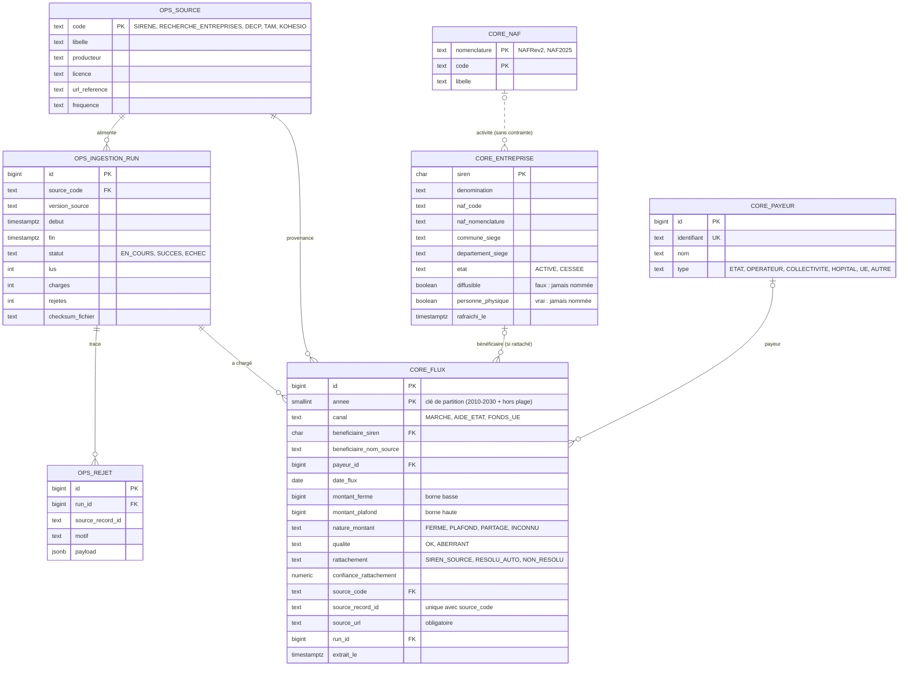

# Modèle de données

> État au lot 1, étape 2 (migrations `V1` à `V5`). Référence : `SPEC.md` §6. Les tables `raw.*` (une par source de flux) arrivent avec chaque ingestion, `mart.*` avec l'API (lot 3), `ops.signalement` au lot 6.

## Règles portées par la base

- **Provenance** : `source_code`, `source_record_id`, `source_url`, `run_id`, `extrait_le` obligatoires sur chaque flux.
- **Montants** : entiers en euros, jamais négatifs ; `montant_ferme` ≤ `montant_plafond` ; un flux `FERME` a deux bornes égales ; seul un flux `INCONNU` peut n'avoir aucun montant.
- **Rattachement** : un flux `NON_RESOLU` n'a jamais de SIREN, un flux rattaché en a toujours un ; `SIREN_SOURCE` implique une confiance de 1.
- **Année** : `annee` = année de `date_flux` ; chaque flux est rangé dans la partition de son année.

## Qui peut faire quoi

| Rôle | `ops` | `raw` | `core` | `mart` | Structure (DDL) |
|---|---|---|---|---|---|
| Utilisateur de migration | tout | tout | tout | tout | **oui** (seul) |
| `suivons_ingestion` | lecture et écriture (`source` en lecture) | lecture et écriture | lecture et écriture | lecture et écriture | non |
| `suivons_api` | lecture de `source` et `ingestion_run` | aucun accès | lecture | lecture | non |

Tables techniques non représentées : `ops.batch_*` (Spring Batch) et `public.flyway_schema_history`.
